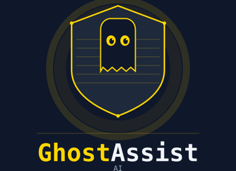

<p align="center">
  
</p>

<p align="center">
  <a href="LICENSE"></a>
  
  
  
  <a href="https://github.com/jimokonma/Ghost-Assist-AI/issues"></a>
</p>

<h3 align="center">Invisible real-time AI assistant for meetings, interviews, and live calls</h3>
<p align="center">Powered by Claude + Whisper &nbsp;·&nbsp; Free &amp; open source &nbsp;·&nbsp; Windows 10/11</p>

---

GhostAssist AI is a **free, open-source** Windows desktop application. It floats as a transparent overlay — visible only to you — and responds to spoken questions in under 3 seconds. The window is excluded from all screen capture at the OS level, making it completely invisible to Zoom, Google Meet, Microsoft Teams, and OBS.

---

## Features

- **Stealth overlay** — uses `SetWindowDisplayAffinity(WDA_EXCLUDEFROMCAPTURE)` to hide the window from all screen sharing software
- **Hold-to-record** — hold `Alt+Z` to capture system audio, release to transcribe and get an AI response
- **Screenshot analysis** — hold `Alt+S` to capture your screen and send it to Claude Vision for coding problem analysis
- **5 response modes** — Interview, Coding, Meeting, Sales, and General, each with a tailored prompt
- **Knowledge base** — upload your resume or docs; Claude uses them to personalise answers
- **Session history** — all exchanges saved locally to SQLite; browse and replay past sessions
- **Streaming responses** — tokens stream into the overlay in real time as Claude generates them
- **Fully configurable** — hotkeys, font size, opacity, audio device, and mode all controllable in Settings
- **Local-first** — no telemetry, no cloud sync; only audio and text leave the device to hit the APIs

---

## Requirements

- Windows 10 (build 19041+) or Windows 11
- Node.js v20 LTS
- npm v10+
- [ANTHROPIC_API_KEY](https://console.anthropic.com) — for Claude AI responses
- [OPENAI_API_KEY](https://platform.openai.com) — for Whisper audio transcription

---

## Installation

```bash
# 1. Clone the repo
git clone https://github.com/jimokonma/Ghost-Assist-AI.git
cd Ghost-Assist-AI

# 2. Install dependencies
npm install

# 3. Configure environment
copy .env.example .env
```

Edit `.env` and add your keys:

```env
ANTHROPIC_API_KEY=your_anthropic_key_here
OPENAI_API_KEY=your_openai_key_here
```

---

## Running the App

**Development mode (with hot reload):**

```bash
npm run dev
```

**Build a distributable `.exe`:**

```bash
npm run package
```

The installer is output to the `dist/` folder in the project root.

---

## Audio Setup

GhostAssist records from your system's default recording device. To capture **meeting audio** rather than your microphone, you need a loopback device:

**Option A — VB-Cable (recommended, free)**
1. Download and install [VB-Cable](https://vb-audio.com/Cable/)
2. In Windows Sound settings, set "CABLE Output" as your default recording device
3. Route your meeting app audio output to CABLE Input

**Option B — Windows Stereo Mix**
1. Right-click the speaker icon → Sound settings → Recording devices
2. Right-click in the list → Show Disabled Devices
3. Enable "Stereo Mix" if it appears

---

## Hotkeys

All hotkeys are configurable in **Settings → Hotkeys** (`Alt+,`).

| Hotkey | Action |
|--------|--------|
| `Alt+Z` (hold) | Record system audio — release to transcribe and get response |
| `Alt+S` (hold) | Capture screenshot — release to send to Claude Vision |
| `Alt+H` | Toggle overlay visibility |
| `Alt+C` | Clear the answer panel |
| `Alt+M` | Cycle modes: General → Interview → Coding → Meeting → Sales |
| `Alt+,` | Open Settings |
| `Alt+[` / `Alt+]` | Decrease / increase opacity |
| `Alt+-` / `Alt+=` | Decrease / increase font size |

---

## Response Modes

| Mode | Behaviour |
|------|-----------|
| **Interview** | STAR-framed answers; pulls from your knowledge base (resume) |
| **Coding** | Problem restatement, brute force, optimal approach, code, complexity |
| **Meeting** | Concise answers with action items highlighted |
| **Sales** | Objection handling, value positioning, suggested next steps |
| **General** | Default — structured, concise, markdown-formatted |

---

## Stealth Window

The overlay uses the Windows `SetWindowDisplayAffinity(WDA_EXCLUDEFROMCAPTURE)` API, which instructs the OS to render the window on your physical monitor but exclude it from all DirectX and GDI capture calls. This makes it invisible to:

- Zoom (v5.x and v6.x)
- Google Meet (Chrome and Electron)
- Microsoft Teams
- WebEx
- OBS Studio (window capture mode)

**Zoom 6.16+ note:** Go to Zoom Settings → Share Screen → Advanced and enable "Show screen capture option". GhostAssist remains invisible.

---

## Architecture

```
src/
├── main/                   Main process (Node.js)
│   ├── index.js            App entry, IPC handlers, session management
│   ├── stealth.js          SetWindowDisplayAffinity native API call
│   ├── hotkeys.js          uiohook hold-to-record + globalShortcut fallback
│   ├── audio.js            Audio recording coordination
│   ├── transcription.js    OpenAI Whisper API
│   ├── screenshot.js       Electron desktopCapturer
│   ├── claude.js           Anthropic SDK streaming + mode prompts
│   ├── database.js         node-sqlite3-wasm CRUD
│   └── eventbus.js         Central EventEmitter
├── preload/
│   └── index.js            Context bridge (IPC API surface)
└── renderer/               React UI
    ├── App.jsx             Root component, state machine
    └── components/
        ├── StatusBar.jsx         Mode badge + recording indicator
        ├── AnswerPanel.jsx       Markdown renderer (marked + highlight.js)
        ├── TranscriptPanel.jsx   Last transcribed question
        ├── ActionBar.jsx         Text input + quick buttons
        ├── SettingsPanel.jsx     Hotkeys, knowledge base, appearance
        └── HistoryPanel.jsx      Session history browser
```

**Stack:**
- Electron 34 + React 18 + Vite (electron-vite)
- Tailwind CSS
- `@anthropic-ai/sdk` — Claude streaming
- `openai` SDK — Whisper transcription
- `node-sqlite3-wasm` — local SQLite (WASM, no native compilation needed)
- `uiohook-napi` — hold-to-record hotkey detection
- `koffi` — `SetWindowDisplayAffinity` native call (pre-built, no compilation needed)

---

## Data & Privacy

- All session data stored locally: `%APPDATA%\GhostAssistAI\data.db`
- No telemetry, no analytics, no cloud sync
- The only data that leaves your device: audio sent to the Whisper API, and text/images sent to the Claude API
- Clear all data at any time: **Settings → Data → Clear All Session Data**

---

## Contributing

Contributions are welcome! GhostAssist AI is fully open source under the MIT license.

1. Fork the repository
2. Create a feature branch: `git checkout -b feature/my-feature`
3. Commit your changes: `git commit -m "add my feature"`
4. Push and open a pull request

Please [open an issue](https://github.com/jimokonma/Ghost-Assist-AI/issues) first for significant changes or new features — it helps avoid duplicate work and keeps direction aligned.

---

## License

MIT © [Digital Okonma Technologies](https://github.com/jimokonma) — free to use, modify, and distribute.
